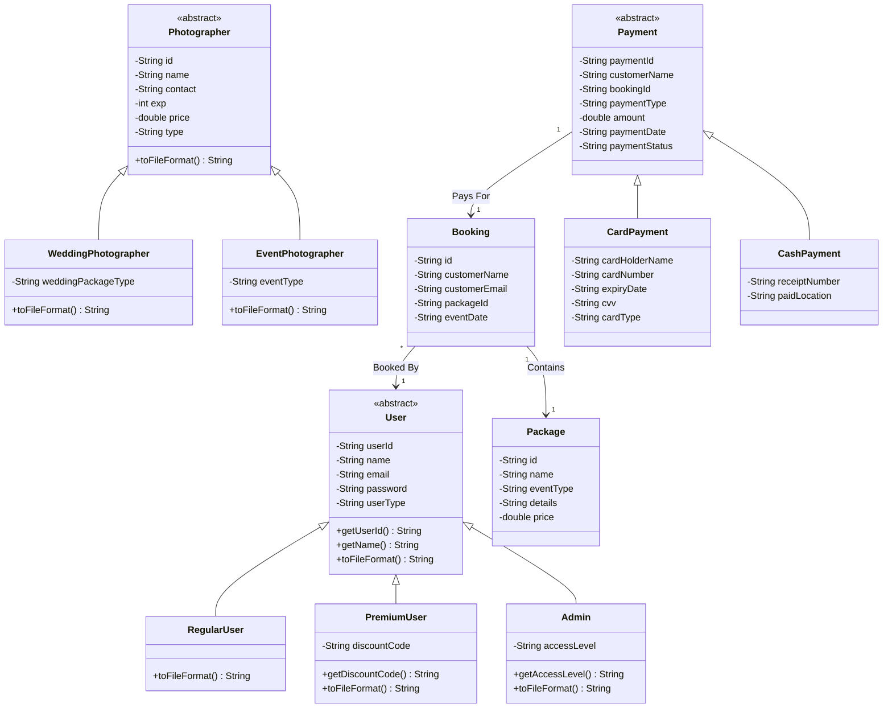

# System UML Diagram

```mermaid
classDiagram
    %% Inheritance: Users and Admin
    class User {
        <<abstract>>
        -String userId
        -String name
        -String email
        -String password
        -String userType
        +getUserId() String
        +getName() String
        +toFileFormat() String
    }

    class RegularUser {
        +toFileFormat() String
    }

    class PremiumUser {
        -String discountCode
        +getDiscountCode() String
        +toFileFormat() String
    }

    class Admin {
        -String accessLevel
        +getAccessLevel() String
        +toFileFormat() String
    }

    User <|-- RegularUser
    User <|-- PremiumUser
    User <|-- Admin

    %% Photographers
    class Photographer {
        <<abstract>>
        -String id
        -String name
        -String contact
        -int exp
        -double price
        -String type
        +toFileFormat() String
    }

    class WeddingPhotographer {
        -String weddingPackageType
        +toFileFormat() String
    }

    class EventPhotographer {
        -String eventType
        +toFileFormat() String
    }

    Photographer <|-- WeddingPhotographer
    Photographer <|-- EventPhotographer

    %% System Models
    class Booking {
        -String id
        -String customerName
        -String customerEmail
        -String packageId
        -String eventDate
    }

    class Package {
        -String id
        -String name
        -String eventType
        -String details
        -double price
    }

    %% Payments
    class Payment {
        <<abstract>>
        -String paymentId
        -String customerName
        -String bookingId
        -String paymentType
        -double amount
        -String paymentDate
        -String paymentStatus
    }

    class CardPayment {
        -String cardHolderName
        -String cardNumber
        -String expiryDate
        -String cvv
        -String cardType
    }

    class CashPayment {
        -String receiptNumber
        -String paidLocation
    }

    Payment <|-- CardPayment
    Payment <|-- CashPayment

    %% Associations
    Booking "1" --> "1" Package : Contains
    Payment "1" --> "1" Booking : Pays For
    Booking "*" --> "1" User : Booked By
```
